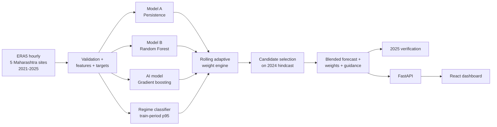

# WEAVE: Adaptive Weather Forecast Blending

A hybrid AI–NWP blending framework. It combines several forecast sources with
**adaptive weights** learned from historical skill, conditioned on **region,
season, lead time, weather regime and hour of day**. The output is an optimised
forecast for **rainfall, temperature and wind**, plus **extreme-weather
guidance**. An operational workflow and a live dashboard run it end to end.


## Expected outcomes → where they live

| Problem-statement outcome | Delivered by |
|---|---|
| **Dynamically blended forecast** | `src/blending/operational.py`: rolling-origin blend of every forecast. Weights are re-learned monthly from already-verified cases only. |
| **Model weight maps** | `weights.json` (location × lead / season / regime / month) and the dashboard's *Model Weight Map* (map donuts + dominant-model grid) |
| **Improved forecast skill** | Blend beats the best single model in 8 of 9 variable/lead combinations on 2025 (table below) |
| **Extreme weather guidance** | `src/evaluation/extreme_guidance.py`: CSI-tuned heavy-rain / heat / high-wind signals with model-agreement probability. Up to +59% CSI over the best raw model (high wind, 12h). |
| **Operational workflow** | `python -m src.workflow` (one command, about 2 min) → `uvicorn src.api.main:app` → dashboard. `POST /api/blend` blends new forecasts on demand. |

## Results (2025, fully out-of-sample)

Models were trained on 2021–2024. Every blending choice (weighting method,
bias correction, conditioning ladder) was made on the **2024 hindcast** and then
frozen, so none of these numbers come from tuning on 2025.

**MAE by source** (lower is better):

| Variable | Lead | Persistence | Random Forest | AI (GBT) | Simple mean | **WEAVE blend** | vs best model |
|---|---|---|---|---|---|---|---|
| Rainfall (mm/h) | 6h | 0.2083 | 0.1817 | 0.1785 | 0.1813 | **0.1766** | **+1.1%** |
| | 12h | 0.2369 | 0.1958 | 0.1898 | 0.1971 | **0.1880** | **+0.9%** |
| | 24h | 0.2307 | 0.2036 | 0.1991 | 0.2014 | **0.1933** | **+2.9%** |
| Temperature (°C) | 6h | 3.7848 | 0.7650 | 0.7794 | 1.4775 | **0.7563** | **+1.1%** |
| | 12h | 5.3993 | 0.7811 | 0.7594 | 1.9470 | 0.7605 | −0.1% |
| | 24h | 0.8301 | 0.8122 | 0.8125 | 0.7994 | **0.7992** | **+1.6%** |
| Wind (m/s) | 6h | 0.8783 | 0.5562 | 0.5640 | 0.6049 | **0.5383** | **+3.2%** |
| | 12h | 1.0030 | 0.5777 | 0.5779 | 0.6400 | **0.5676** | **+1.8%** |
| | 24h | 0.6747 | 0.6167 | 0.6243 | 0.6123 | **0.6120** | **+0.8%** |

The naive simple mean is dragged down by the weak member (e.g. persistence at
6–12h for temperature). The adaptive blend learns to ignore that member where
it's poor and to use it where it helps (24h, when the diurnal cycle realigns).

**Extreme events, critical success index (CSI), 12h lead:**

| Event (local p95 exceedance) | Best raw model | Blend at raw threshold | **WEAVE guidance** |
|---|---|---|---|
| Heavy rainfall | 0.147 | 0.115 | **0.148** |
| High wind | 0.213 | 0.256 | **0.338** |
| Heat | 0.620 | 0.614 | 0.614 |

Full tables (POD, FAR, frequency bias, and results per location, season and
regime) are in the dashboard and in `data/processed/artifacts/*.json`.

## Quick start

```bash
python -m venv venv && venv/Scripts/activate      # Windows (source venv/bin/activate elsewhere)
pip install -r requirements.txt

python -m src.workflow            # ~2 min; add --retrain to retrain all models (~12 min)
uvicorn src.api.main:app          # API on http://127.0.0.1:8000

cd frontend && npm install
npm run dev                       # dashboard on http://localhost:5173 (proxies /api)
# or: npm run build   -> the API then serves the dashboard itself at http://127.0.0.1:8000
```

Tests: `pytest` (77 tests: pipeline, models, leakage guards, blending,
guidance, API).

### Routine (scheduled) blending

The workflow is idempotent and writes all its outputs to
`data/processed/artifacts/`. To schedule it, point cron or Windows Task
Scheduler at the repo root:

```
0 */6 * * *  cd /path/to/WEAVE && venv/bin/python -m src.workflow
```

The API reloads the artifacts when it restarts. For one-off forecasts from new
model runs, use the API directly:

```bash
curl -X POST localhost:8000/api/blend -H "Content-Type: application/json" -d '{
  "location": "Mumbai", "season": "Monsoon", "weather_regime": "Heavy Rain",
  "target_variable": "precipitation_mm", "lead_time_hours": 12, "issue_hour": 6,
  "forecasts": {"model_a": 4.1, "model_b": 2.7, "ai_model": 3.3}}'
```

## How it works



1. **Forecast sources.** Three members with a shared interface
   (`src/data_pipeline/model_interface.py`). Each is trained per (variable,
   lead) in two out-of-sample runs: *hindcast* (train 2021–23 → forecast 2024)
   and *operational* (train 2021–24 → forecast 2025). Real NWP or AI feeds plug
   into the same `*_forecast` columns.
2. **Weather regime.** Heavy Rain / Heat / High Wind / Normal from location ×
   season 95th percentiles, calibrated on the training period only.
3. **Adaptive weights.** At the start of each month, skill is measured on every
   forecast whose verifying observation already exists, grouped by variable +
   lead and then a fallback ladder: location·season·hour → location·hour →
   location·season·regime → location·season → location → global → equal. The
   most specific group with at least 50 verified cases wins.
4. **Weighting methods.** Equal, inverse-MAE (the original `weight_engine`),
   inverse-MSE, and **optimal**: non-negative least squares stacking,
   normalised to a convex combination, which accounts for correlated errors.
   Each can run with per-group mean-bias correction. That gives 12 candidates
   (3 configurations × 4 methods).
5. **Selection.** For each (variable, lead), the candidate with the lowest 2024
   hindcast MAE is chosen. For example, bias correction is kept off for
   zero-heavy rainfall, and diurnal weights are used for wind.
6. **Extreme guidance.** An event fires when the blend exceeds `scale × p95`,
   with the scale tuned for CSI on 2024. The event probability is the
   skill-weighted share of members that agree.

Leakage guards are covered by tests: lead-time targets never cross the
train/test boundary, weights only see observations verified before the update
time, and regime thresholds come from training data only.

## Project structure

| Path | Contents |
|---|---|
| `ai/` | Data loader, feature engineering, regime calibration and classifier (reference implementations) |
| `src/data_pipeline/` | Config, validation, features, lead-time targets, leakage-safe splits |
| `src/models/` | Persistence, Random Forest, AI (gradient-boosted trees), forecast generation |
| `src/regime/` | Vectorized, train-calibrated regime classification |
| `src/blending/` | Weight engine, single-case adaptive blender, operational rolling blender |
| `src/evaluation/` | Metrics, skill tables, extreme-event verification and guidance |
| `src/workflow.py` | End-to-end operational workflow |
| `src/api/` | FastAPI service |
| `frontend/` | React + Vite dashboard |
| `tests/` | Pytest suite |
| `docs/` | Architecture and data schema |

## Team

| Module | Owner |
|---|---|
| Data Pipeline | Member 1 |
| Adaptive Blending | Member 2 |
| Weather Regime | Member 3 |
| Evaluation | Member 4 |
| Dashboard | Member 5 |

## Limitations

- The members are statistical/ML models driven by ERA5 reanalysis, standing in
  for NWP and AI weather models. The framework is source-agnostic, but the
  skill numbers are for these members.
- Five grid points, hourly data, and leads of 6/12/24h. Heat events are hourly
  p95 exceedances, not IMD's daily heat-wave criteria.
- Temperature at 12h lead is the one combination where the blend ties rather
  than beats the best member (−0.15%).
- Heat guidance adds nothing over the raw blend (its tuned scale is 1.0). At
  24h lead, persistence detects high wind and heavy rain about as well as the
  guidance does, because the same hour yesterday is a strong analogue.
