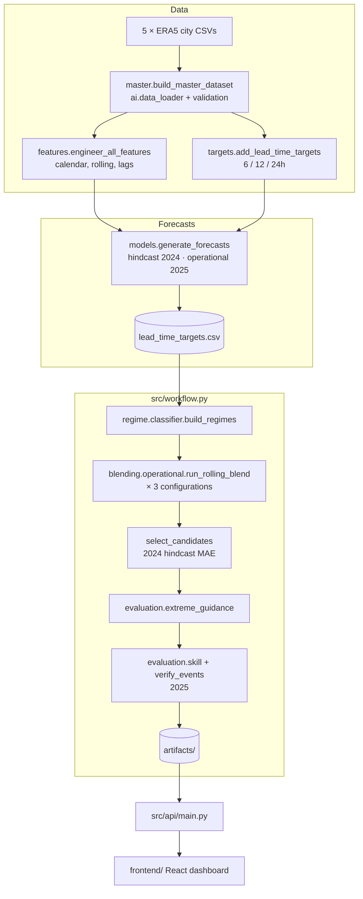

# Architecture



## Timeline and leakage rules

| Period | Role |
|---|---|
| 2021–2023 | Training for the hindcast run |
| 2024 | Hindcast forecasts: skill history for weights; selection of candidate and guidance scale |
| 2021–2024 | Training for the operational run; regime and event threshold calibration |
| 2025 | Operational forecasts, verified once |

- A training row is used only if its target (`timestamp + lead`) is at or before the train end.
- Weights for a month use only forecasts whose target time is before that month starts.
- Candidate choice and guidance scales are fixed from 2024 before 2025 is scored.

## Adaptive weight engine

`skill_table(history, keys)` computes, for every group of `target_variable ×
lead_time_hours × keys`:

- `bias_m`: the mean error of model *m* (zero when bias correction is off)
- `mae_m`: the MAE after bias correction
- `w_<method>_m`: weights for each of the equal, inverse-MAE, inverse-MSE and optimal (NNLS) methods

`blend_rows` walks the ladder from most to least specific and takes the first
group with at least `min_samples` cases. If a member is missing for a row, its
weight is dropped and the rest are renormalised. Rainfall and wind blends are
clipped at 0.

Two blending APIs share the same components:

- `adaptive_blender.adaptive_blend`: single case, inverse-MAE, the original ladder (location/season/lead/regime)
- `operational.run_rolling_blend`: vectorized, all methods and configurations, rolling-origin

## Live mode (`src/live/`)

```mermaid
flowchart LR
  G[Open-Meteo geocoding<br/>India only] --> P[place]
  P --> F[forecast API<br/>IFS · GFS · ICON · AIFS latest runs]
  P --> H[previous-runs API<br/>archived forecasts, lead days 0-7]
  P --> T[ERA5 archive<br/>hourly truth, ~6-day lag]
  P --> C[ERA5 daily, 2 years<br/>day-of-year p95 thresholds]
  H & T --> S[skill_state<br/>fit / select / evaluate windows]
  S & F --> B[blend_rows<br/>same engine as historical]
  C --> E[daily extreme events]
  B --> E
  B & E --> API[/api/live/*]
```

| Module | Role |
|---|---|
| `openmeteo.py` | HTTP client with TTL cache (`cache.py`) and a request budget based on Open-Meteo's own call weighting (`max(1, vars/10) × max(1, days/14)`). It waits out the per-minute limit and refuses cleanly past the hourly or daily budget. |
| `engine.py` | Per place: 120 days of history split into fit, select (21 d) and evaluate (21 d) windows. The candidate (config × method, including best-single-model) is chosen on select and scored on evaluate, then refitted on everything. Skill state is cached 24 h. |
| `service.py` | Result cache (30 min), background warm-up of the 24 tracked cities (2 threads), and headline summaries for the map. |
| `cities.py` | Tracked city names and states. Coordinates always come from geocoding, and resolution never crosses states. |
| `outlook.py` | Plain-language daily wording, IMD rainfall categories and heat-wave rules, Beaufort wind wording |
| `alerts.py` | Official CAP warnings from NDMA SACHET (IMD, CWC, SDMAs), matched to places by distance or state name |
| `grid.py` | 124-point 1.5° India grid (Survey of India boundary, datameet CC-0), blended with weights borrowed from the nearest verified cities |

Members: ECMWF IFS, NCEP GFS and DWD ICON (NWP), the ECMWF ENS mean (ensemble; its live run comes from the
ensemble API), and ECMWF AIFS (AI). The 51 ensemble members also supply daily event probabilities.
UKMO, JMA and GEM were tested as extra members and rejected (no held-out gain).

Leads: Open-Meteo archives forecasts by lead **day** (`previous_dayN`), so the
live leads are days 0–7. A valid time *h* hours ahead uses the weights for
day `floor(h/24)`.

Extremes: judged per IST day. The blended daily max temperature, rain total or
max wind is compared with the 95th percentile of the same ±15 days of year over
the place's last 2 years of ERA5 (rain: wet days ≥ 1 mm only). The agreement
score is the skill-weighted share of bias-corrected members reaching it.

Budget: a new place costs about 145 call units the first time (skill history
≈ 83, truth ≈ 10, climatology ≈ 52); after that, mostly cache hits. The free
tier allows 600 units per minute, 5,000 per hour and 10,000 per day.

## API

| Endpoint | Purpose |
|---|---|
| `GET /api/health` | Liveness and whether artifacts are available |
| `GET /api/meta` | Run manifest |
| `GET /api/snapshot?time&lead` | All locations × variables at one issue time |
| `GET /api/series?location&variable&lead&time` | Members, blend and observation around an issue time |
| `GET /api/daily?location&variable&lead` | Daily summary for the whole year |
| `GET /api/weights`, `/api/skill`, `/api/extremes` | Weight maps, skill tables, event verification (filterable by `variable`, `lead`) |
| `POST /api/blend` | Blend new member forecasts with the learned weights |
| `GET /api/live/search?q` | Places in India (geocoding) |
| `GET /api/live/forecast?lat&lon&name` | Live 7-day blend, weights per lead day, daily extremes, held-out skill |
| `GET /api/live/cities` | Tracked cities: status (ready / pending / error) and summaries |
| `GET /api/live/models` | Member models and their latest run times |

The interactive docs are at `/docs`.
