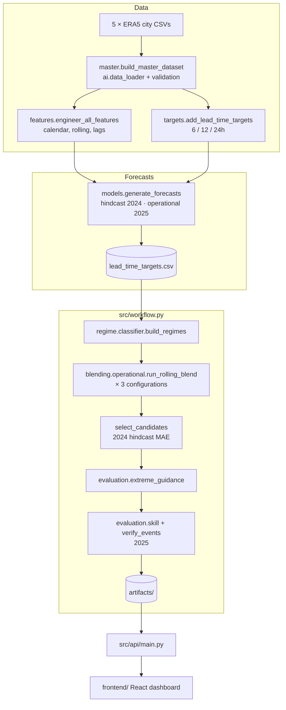

# Architecture

## Timeline and leakage rules

| Period | Role |
|---|---|
| 2021–2023 | Training for the hindcast run |
| 2024 | Hindcast forecasts: skill history for weights; selection of candidate and guidance scale |
| 2021–2024 | Training for the operational run; regime and event threshold calibration |
| 2025 | Operational forecasts, verified once |

- A training row is used only if its target (`timestamp + lead`) is at or before the train end.
- Weights for a month use only forecasts whose target time is before that month starts.
- Candidate choice and guidance scales are fixed from 2024 before 2025 is scored.

## Adaptive weight engine

`skill_table(history, keys)` computes, for every group of `target_variable ×
lead_time_hours × keys`:

- `bias_m`: the mean error of model *m* (zero when bias correction is off)
- `mae_m`: the MAE after bias correction
- `w_<method>_m`: weights for each of the equal, inverse-MAE, inverse-MSE and optimal (NNLS) methods

`blend_rows` walks the ladder from most to least specific and takes the first
group with at least `min_samples` cases. If a member is missing for a row, its
weight is dropped and the rest are renormalised. Rainfall and wind blends are
clipped at 0.

Two blending APIs share the same components:

- `adaptive_blender.adaptive_blend`: single case, inverse-MAE, the original ladder (location/season/lead/regime)
- `operational.run_rolling_blend`: vectorized, all methods and configurations, rolling-origin

## API

| Endpoint | Purpose |
|---|---|
| `GET /api/health` | Liveness and whether artifacts are available |
| `GET /api/meta` | Run manifest |
| `GET /api/snapshot?time&lead` | All locations × variables at one issue time |
| `GET /api/series?location&variable&lead&time` | Members, blend and observation around an issue time |
| `GET /api/daily?location&variable&lead` | Daily summary for the whole year |
| `GET /api/weights`, `/api/skill`, `/api/extremes` | Weight maps, skill tables, event verification (filterable by `variable`, `lead`) |
| `POST /api/blend` | Blend new member forecasts with the learned weights |

The interactive docs are at `/docs`.
